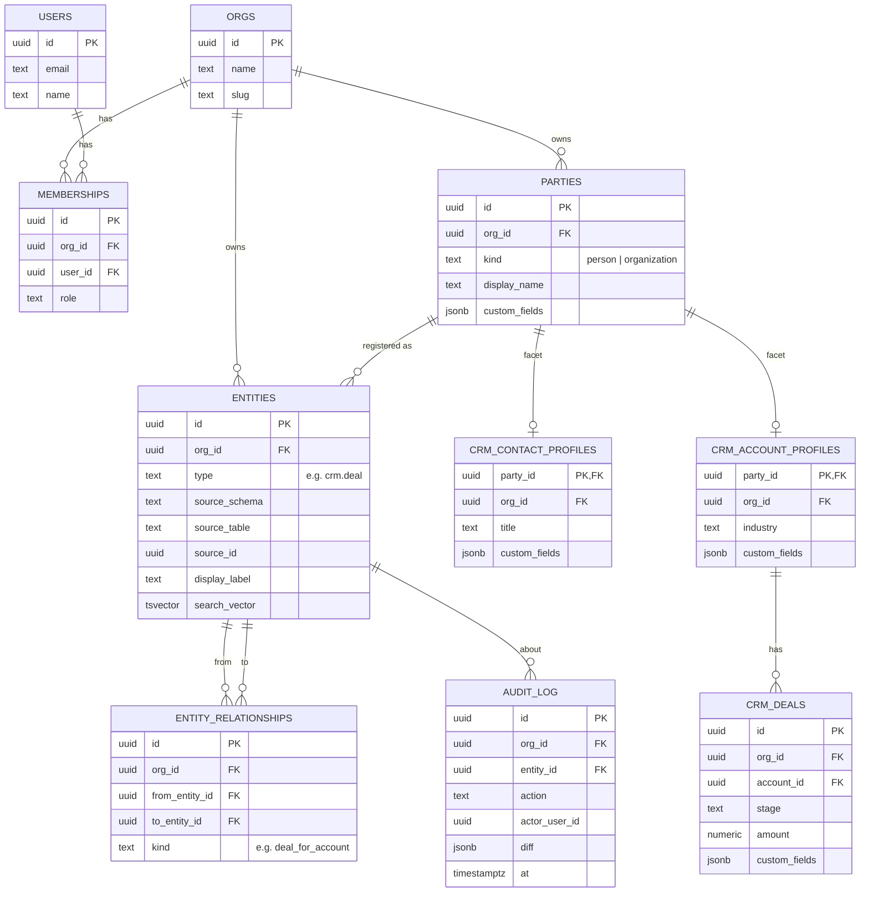

# embody — Architecture

> **Read this first.** This document explains how the whole system fits together in
> plain language. If you're new to the codebase, start here. It is the source of
> truth for _why_ things are built the way they are — the code is the source of
> truth for _how_.

---

## 1. What embody is (in one paragraph)

`embody` is an open-source, AI-native, **headless business operating system**. Think
of it as a foundation that a company can run instead of paying for a pile of separate
SaaS subscriptions (CRM, accounting, support, …). It is a **microkernel**: a tiny
core that does almost nothing on its own, plus **plugins** that add all the real
features. First-party apps like the CRM are just plugins — built on the exact same
framework a customer would use to build their own. The goal is that **any company can
build and adjust its own apps — schemas, workflows, logic — on top of this, without
forking the core.**

---

## 2. Glossary (plain language)

| Term | Meaning |
| --- | --- |
| **Microkernel** | A tiny core that does almost nothing on its own; features are added as plug-in modules. |
| **Plugin** | A self-contained feature module (e.g. CRM). Adds its own tables, API routes, and logic. |
| **Multi-tenant** | One running system safely serves many companies at once. Each company is a "tenant." |
| **`org_id`** | A column on every row marking which company (tenant) owns it. |
| **RLS (Row-Level Security)** | A Postgres feature that automatically hides rows belonging to the wrong tenant — enforced by the database, not by us remembering to filter. |
| **ORM / Drizzle** | A library to define and query tables in TypeScript instead of raw SQL. |
| **Migration** | A versioned script that changes the database structure. Run in order, they build the schema from scratch. |
| **JSONB / `custom_fields`** | A Postgres column that stores flexible, schema-less data, so a company can add fields without changing the table. |
| **GIN index** | A special index that makes searching _inside_ JSONB fast. |
| **Entity registry (`entities`)** | One small table holding a _pointer_ to every record (type, id, display name). Used for global search, linking records, and audit. It does **not** hold the real data. |
| **Facet / profile table** | Extra per-app data attached to a shared record. One person can have a "CRM contact" facet and an "accounting customer" facet. |
| **Foreign key (FK)** | A rule that a column must point to a real row in another table. How Postgres keeps data consistent. |
| **Hook** | A function that runs _in the middle of_ another action (e.g. right before a deal saves) and can change or block it. Synchronous, inside the DB transaction. |
| **Event / EventBus** | A message published _after_ something happened (e.g. `deal.created`). Others react. Asynchronous, cannot block. |
| **Outbox** | Events stored durably in the DB so they survive a server restart. |
| **DI / service registry** | A shared directory where plugins publish helper functions ("services") that other plugins look up and call. |
| **Middleware** | Code that runs on every web request before the handler (logging, rate-limiting, …). |
| **MCP (Model Context Protocol)** | A standard that lets AI assistants call our tools safely with typed inputs. |
| **Zod** | A TypeScript library that checks inputs match an expected shape. |
| **SPI (Service Provider Interface)** | The stable, published set of functions a plugin may rely on. We promise not to break it. |
| **semver** | The `1.2.3` version scheme; a change to the first number means "breaking change." |
| **Topo-sort** | Ordering things so dependencies come first (load `core` before plugins that need it). |
| **EAV** | An over-flexible "everything is key-value rows" pattern. We **avoid** it — it throws away Postgres's safety. |

---

## 3. The eight design decisions

### D1 — Multi-tenant from day one (open-core)
Every business row carries an **`org_id`**, and Postgres **RLS** policies hide other
tenants' rows automatically. The self-hosted default runs with a single seeded org
(near-zero overhead), while the same code can serve many companies for the premium
hosted product. **Why:** building single-tenant first and retrofitting multi-tenancy
later forces the hosted and self-host products to fork. We pay the small cost once.

### D2 — Relational-first data, thin registry on top
Plugins own **real, typed tables** with real columns, foreign keys, and constraints
(a deal's `amount` is a number, its `account_id` points at a real party). On top sits
a **thin `entities` registry** — a pointer table, not a data store — that exists only
for three cross-cutting jobs: **global search**, **linking records across plugins**
(the `entity_relationships` edge table), and **audit history**. `custom_fields` JSONB
is available per table but opt-in, and GIN-indexed only where a field is marked
queryable. **Why:** we get Postgres's integrity and speed _and_ runtime flexibility,
without the EAV "inner-platform" trap.

### D3 — Shared "core" entities, per-app facets
The same real-world thing appears in many apps: a person is a CRM contact, an
accounting customer, an HR employee. A **`core` plugin owns the shared entities**
(`parties`, `products`, `documents`) plus identity. Each app attaches a **facet
table** keyed by the shared id (`crm.contact_profiles(party_id → core.parties)`).
**One party, many app facets.** Apps must never keep their own private copy of a
party. **Why:** this is what makes embody a unified system of record instead of "N
plugins that each re-silo the same customer."

### D4 — Identity and central authorization
`core` owns `users`, `orgs`, `memberships` (who belongs to which company, with what
role). Authorization is resolved centrally in the kernel and exposed to plugins as
`ctx.can(action, resource)`. **Every REST route and every MCP (AI) tool passes
through the same check** — the AI tools are not a back door around permissions.

### D5 — Durable events and jobs
Domain events (`deal.created`, `account.updated`) are written into a database
**outbox in the same transaction** as the data change, then dispatched. They survive
restarts and can safely drive real workflows. Exposed to plugins behind an
`EventBus` interface (implementation: transactional outbox / `pg-boss`).

### D6 — Real migrations and namespacing
Schema changes go through **Drizzle migrations only** (versioned SQL — no `db push`
in real environments); migrations also define RLS policies and GIN indexes, and CI
runs them against a fresh database. Each plugin owns **its own Postgres schema**
(`core.*`, `crm.*`), and everything else is namespaced too: entity types (`crm.deal`),
MCP tools (`crm_*`), routes (`/crm/*`), events (`crm.deal.created`), permissions
(`crm:deal:read`). Plugins declare `dependsOn`, and the kernel **topo-sorts** load +
migration order so `core` exists before apps that need it.

### D7 — Four extension surfaces (so plugins compose, not just coexist)
All owned by the kernel because they're impossible to retrofit cleanly:
1. **Middleware pipeline** — plugins contribute ordered request middleware.
2. **Domain hooks** — synchronous, in-transaction, and **vetoable**: a handler on
   `entity.beforeCreate/beforeDelete/…` can mutate the payload or throw to block it.
   This is how one plugin extends another _without editing it_.
3. **Service registry (DI)** — plugins `provide` typed services and `consume` others'
   via `ctx.services.get(Contract)`, so they can work together.
4. **Contribution points** — named slots a plugin exposes for others to fill (layered
   in later; enabled by hooks + services).

Two interception models on purpose: **hooks** (before, can veto) and **events**
(after, side-effects only). **Guardrail:** each plugin declares a **capability
manifest** of what entities/services/hooks it may touch, and the kernel enforces it,
so an untrusted plugin is sandboxed.

### D8 — Customization without forking (the core product goal)
Code-first, **no low-code builder and no runtime metadata engine** — instead the
architecture makes customization easy and upgrade-safe:
- **Schema, two tiers:** (a) a company writes its own plugin with real migrations
  (full power); (b) it adds a field to an existing entity via `custom_fields` with no
  migration and no edit to that plugin (easy tier).
- **Logic:** custom behavior comes from the D7 surfaces — hooks, events, services —
  plus a thin `automation` helper (`when <event> [if <condition>] do <action>`).
- **Upgradeability:** the repo is split into five buckets by owner. `framework/`,
  `catalog/` and `examples/` come from upstream; `custom/` (your plugins) and `deploy/`
  (your deployables) are yours, and upstream never writes to them. Since `git merge`
  can only conflict on files you have edited, a customized instance takes upstream
  releases cleanly. This is the difference between "customizable" and "forked and
  stranded."

**What makes this real rather than aspirational** — three properties, each mechanical:

1. **Your rules gate real writes.** Entity writes go through `defineEntity`
   (`@embody/plugin-sdk`), which merges the caller's patch onto the stored row and then
   runs the `before*` hook chain **inside the tenant transaction**. Your handler sees
   the whole row — including fields the caller never sent — and throwing rolls the write
   back. So you change how a catalog app behaves without editing it, and the rule binds
   AI agents, REST and the CLI identically.
2. **Enabling a customization touches only your files.** A deployment lives in
   `deploy/`, so the line that turns your plugin on is never in an upstream file. (If it
   were, every upgrade would conflict on it, and the promise above would be false.)
3. **Drift is detectable.** `embody doctor` lists every file you have changed inside an
   upstream bucket — committed or not — and exits non-zero, before you merge rather than
   during. Clean doctor, clean merge.

See [OWNERSHIP.md](OWNERSHIP.md).

---

## 4. Plugin lifecycle (the exact startup order)

When the system boots, the kernel processes plugins in this order. Steps 3–11 run
per plugin, but plugins are visited in **`dependsOn` topological order** (so `core`
is fully set up before `crm`).

```
1.  select                The host registers `core` (always) + the apps a deployment
                          enables in its `embody.config.ts` (config-driven, not a
                          filesystem scan). Customer plugins in custom/ register too.
2.  topo-sort             Order them by dependsOn (core first)
── per plugin, in order ──
3.  validate capabilities Reject a plugin that declares grants it isn't allowed
4.  migrate               Run the plugin's migrations (creates its schema + tables,
                          RLS policies, GIN indexes)
5.  register services     Publish this plugin's DI services into the registry
6.  init(ctx)             Plugin setup; may consume other services via ctx.services
7.  registerMiddleware    Add request-pipeline middleware (kernel controls ordering)
8.  registerHooks         Register sync, in-transaction, vetoable domain hooks
9.  registerRoutes        Mount REST routes (all wrapped with tenancy + authz)
10. registerMcpTools      Register MCP/AI tools (Zod-validated, same authz as REST)
    registerMcpResources  Register MCP resources (crm://deals/pipeline, …)
11. registerCliCommands   Add CLI subcommands
12. subscribe(bus)        Subscribe to async post-commit events
── after all plugins ──
13. serve                 a transport starts (HTTP host, or the stdio MCP server)
```

**Why this order matters:** migrations must run before anything queries the DB;
services must be registered before `init` (so a plugin can consume another's service
during its own setup); hooks/routes/tools all register after `init` so the plugin is
fully constructed first.

**Transports over one executor (AI-agent first).** The kernel collects each plugin's MCP
tools + CLI commands during boot; `@embody/host`'s `makeExecutor` turns a booted runtime +
a principal into the single action path — it builds a `RequestContext` whose `tx` is a
tenant-scoped `withTenant` transaction on the app role, so every tool runs under RLS + the
same `can()` authz as REST (D4). Three skins share it: `embody mcp` (a stdio MCP server —
the surface an AI agent registers), `embody call/tools` (one-shot + discovery, for scripting/
CI), and `embody serve` (HTTP). The CLI hardcodes no actions — it reflects whatever the
enabled apps registered, so installing an app makes its tools agent-callable with no CLI change.

---

## 5. Data model (ERD)

Tables split into two groups: **shared** (owned by `@embody/core`, used by every app)
and **app-owned** (owned by one plugin, in that plugin's own schema).



**Shared (schema `core`):** `orgs`, `users`, `memberships`, `parties`, `products`,
`documents`, `entities`, `entity_relationships`, `audit_log`, `outbox`.
**App-owned (schema `crm`):** `crm.deals`, `crm.contact_profiles`,
`crm.account_profiles`.

Key rules visible in the diagram:
- Every business table has `org_id` (RLS lives here).
- A CRM contact/account is a **facet** of a shared `parties` row, not a copy.
- `crm.deals.account_id` is a **real foreign key** into `core.parties` — integrity is
  database-enforced, not app-enforced.
- The `entities` registry points at the typed rows via
  `(source_schema, source_table, source_id)`; relationships and audit reference
  registry ids so they work uniformly across every plugin.

---

## 6. Driving queries (the design must answer these cleanly)

We write the real questions the data model must serve _before_ building, so design
flaws surface while they're cheap to fix. If these are clean, the model works.

**Q1 — Single-app, typed + paginated (the common case).**
> "List the 20 largest open deals for account X."

```sql
SELECT id, stage, amount
FROM crm.deals
WHERE org_id = current_setting('app.current_org')::uuid   -- RLS also enforces this
  AND account_id = $1
  AND stage <> 'won' AND stage <> 'lost'
ORDER BY amount DESC
LIMIT 20;
```
Straight relational query on a typed table with a real FK — fast, indexed, no JSONB
needed. Proves D2 (relational-first).

**Q2 — Custom-field filter (the "easy customization" case).**
> "Find deals where the company-added custom field `priority = 'high'`."

```sql
SELECT id, amount
FROM crm.deals
WHERE org_id = current_setting('app.current_org')::uuid
  AND custom_fields @> '{"priority":"high"}';   -- GIN-indexed containment
```
Proves D8 tier-2: a company filters on a field it added with no migration.

**Q3 — Cross-app graph (the unification payoff).**
> "Show everything linked to person X across _all_ apps (their CRM deals, their
> support tickets, their invoices)."

```sql
-- X is a core.parties row; find its registry id, then walk the edge table.
SELECT e2.type, e2.display_label
FROM core.entities e1
JOIN core.entity_relationships r ON r.from_entity_id = e1.id
JOIN core.entities e2           ON e2.id = r.to_entity_id
WHERE e1.org_id = current_setting('app.current_org')::uuid
  AND e1.source_schema = 'core' AND e1.source_table = 'parties'
  AND e1.source_id = $1;
```
One query returns entities of _any_ type from _any_ plugin. Proves D3 + D2's registry
+ edge design — impossible cleanly without the shared registry.

**Q4 — Global search (spotlight).**
> "Search everything in this org for the text 'acme'."

```sql
SELECT type, display_label
FROM core.entities
WHERE org_id = current_setting('app.current_org')::uuid
  AND search_vector @@ plainto_tsquery('acme')
LIMIT 20;
```
One indexed table covers search across every entity type. Proves the registry's
`search_vector` job.

---

## 7. Where things live (repo map)

The top level is split by **owner**. Upgrades replace the upstream buckets wholesale and
never touch yours (D8).

```
── UPSTREAM ─ do not edit; `git merge upstream/main` replaces these ──────────────

framework/      Framework / runtime — not user-selectable.
  kernel/       Kernel, PluginManager, EmbodyPlugin contract, hooks, DI, middleware,
                EventBus interface, MCP registrar, request context/authz. No business logic.
  db/           Drizzle base: connection, RLS helpers, migration runner, seed utils
  auth/         Principals, RBAC, req.assert() (swappable provider)
  mcp-server/   Universal stdio MCP runner
  cli/          `embody` binary (Commander): agent actions, scaffolds, doctor
  plugin-sdk/   defineEntity — the write path plugins build on. Runs the before*/after*
                hook chains inside the tenant transaction, so a veto rolls the write back.
  core/         @embody/core plugin: shared entities + identity + registry. FOUNDATION —
                always registered by the host; every app dependsOn it. Not selectable.
  host/         @embody/host: reusable server engine. Boots the kernel, reads a
                deployment's embody.config.ts, registers core + enabled plugins, serves.

catalog/        THE CATALOG — selectable business apps.
  crm/          @embody/crm plugin: deals + contact/account facets on core.parties
  b2b-saas/     @embody/b2b-saas: enterprise rules (InfoSec gate on large closes)
  ecom-fulfillment/  @embody/ecom-fulfillment: VIP pricing + warehouse dispatch

examples/       REFERENCE — copy these, don't edit them.
  service-crm/  A deployment enabling catalog apps only
  demo-ui/      The demo SPA: two complete CRMs + AI copilot (Vite, port 5173)

── YOURS ─ upstream never writes here ────────────────────────────────────────────

custom/         Your plugins.
  acme-crm/     Worked example: own schema + RLS, a HIPAA gate on deal closes,
                MCP tools, a CLI command. Private and UNSCOPED — @embody/* is ours.
deploy/         Your deployables. Thin: host + an embody.config.ts + env.
  acme/         Worked example: catalog apps + acme-crm.
```

**Installing / selecting plugins.** A deployment is a `deploy/*` package: install a
catalog app with `pnpm add @embody/erp` and enable it by adding its plugin to `plugins`
in that deployment's `embody.config.ts`. Your own plugins go in the same list — the
kernel does not distinguish them. Run one app per deployment, or list several to
co-locate them (in-process hooks/DI between them). `core` is always present.

Two commands cover the normal path; neither writes to an upstream bucket:

```bash
embody new deployment acme --apps crm,b2b-saas
embody new custom hipaa-rules --for deploy/acme   # creates it AND wires it in
```

---

## 8. Cross-references

The full build plan (milestones M0–M8, verification steps) lives at
`~/.claude/plans/how-would-you-redesign-cuddly-babbage.md`. This document (D1–D8)
is the "why"; the plan is the "when." Plugin-authoring and customization guides
(`PLUGINS.md`, `CUSTOMIZING.md`) land in M8 once the shapes are stable.
