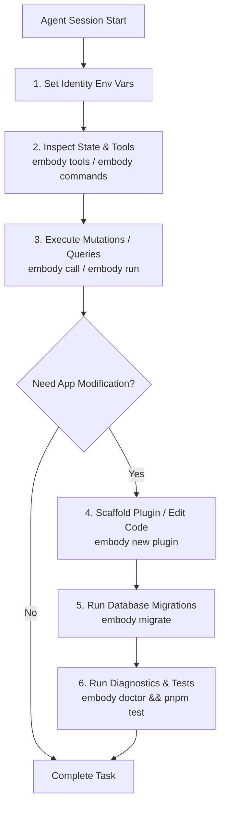

# Comprehensive Embody CLI Reference & Agent Operational Guide (`@embody/cli`)

The **`embody` CLI binary** (`@embody/cli`) is the primary execution and operational entry point for the Embody framework. It operates with a **dual design philosophy**:

1. **Agent-First Action Engine**: Provides an isolated, structured, and identity-aware CLI/stdio surface (`embody mcp`, `embody tools`, `embody call`) allowing AI agents (Claude Desktop, Cursor, Antigravity, custom subagents) to discover tools, execute domain mutations, and query database state as deterministic JSON.
2. **Developer & Operations Tooling**: Provides subcommands to launch the HTTP runtime host (`embody serve`), execute topological SQL database migrations (`embody migrate`), seed tenant environments (`embody seed`), scaffold new app plugins (`embody new plugin`), run health diagnostics (`embody doctor`), and trigger custom domain CLI subcommands (`embody run`).

---

## 🛠️ Global Flags & Multi-Tenant Identity Context

Every CLI command runs through Embody's central identity authorization engine (`principalFrom`) and Row-Level Security (RLS) context. **The CLI is never a back-door superuser bypass.** All data access and mutations are scoped to the acting tenant organization (`core.current_org()`).

### Global Flag Options

| Flag | Environment Variable | Default | Description |
| :--- | :--- | :--- | :--- |
| `-c, --config <path>` | — | `./embody.config.ts` | Path to the application deployment configuration file. |
| `-o, --org <uuid>` | `EMBODY_ORG` | — | Acting organization UUID for multi-tenant database isolation. |
| `-u, --user <uuid>` | `EMBODY_USER` | — | Acting user UUID for audit logging and identity checks. |
| `--roles <csv>` | `EMBODY_ROLES` | `["owner"]` | Comma-separated list of active user roles (e.g. `owner,admin`). |

### Identity Resolution & Safety
If a command requiring database access is executed without an organization identity, the CLI halts execution and raises a clear error:
```text
Error: No org set. Pass --org <id> or set EMBODY_ORG. Run `embody seed` to create a dev org.
```

To set the identity globally in a shell session:
```bash
export EMBODY_ORG="11111111-1111-1111-1111-111111111111"
export EMBODY_USER="22222222-2222-2222-2222-222222222222"
export EMBODY_ROLES="owner,admin"
```

---

## 📐 Stream Separation Architecture (STDOUT vs STDERR)

The CLI strictly enforces process output channel separation:
- **`STDOUT`**: Reserved exclusively for clean, machine-parseable JSON responses. Tools, scripts, and AI agents can pipe `STDOUT` directly into `jq` or JSON parsers without pre-filtering logs.
- **`STDERR`**: Reserved for operational logs, boot diagnostics, status messages, and `embody doctor` reports.

---

## 🤖 AI Agent & Tool Subcommands

### 1. Run Stdio MCP Server (`embody mcp`)
Launches a Model Context Protocol (MCP) server over `stdio`. This allows external AI clients (Cursor, Claude Desktop, Antigravity) to automatically discover and execute all tools registered by enabled app plugins.

```bash
embody mcp -c ./embody.config.ts
```

#### Example Configuration for Cursor (`.cursor/mcp.json`)
```json
{
  "mcpServers": {
    "embody": {
      "command": "pnpm",
      "args": ["embody", "mcp", "-c", "./embody.config.ts"],
      "env": {
        "EMBODY_ORG": "11111111-1111-1111-1111-111111111111",
        "EMBODY_USER": "22222222-2222-2222-2222-222222222222"
      }
    }
  }
}
```

---

### 2. List Registered Tools (`embody tools`)
Lists all agent-callable tools contributed by currently active plugins in the deployment config.

```bash
pnpm embody tools -c ./embody.config.ts
```

#### Output (`STDOUT`):
```json
[
  {
    "name": "crm_create_deal",
    "description": "Create a deal in the current org.",
    "params": ["title", "stage", "amount", "partyId", "customFields"]
  },
  {
    "name": "crm_query_deals",
    "description": "List deals in the current org, optionally filtered by stage.",
    "params": ["stage", "limit"]
  }
]
```

---

### 3. Invoke a Tool Directly (`embody call <tool>`)
Executes a single tool inside a tenant-scoped database transaction. RLS policies and vetoable plugin hook checks (`beforeUpdate`, `beforeDelete`, etc.) are automatically applied.

```bash
pnpm embody call crm_create_deal \
  -o "11111111-1111-1111-1111-111111111111" \
  -u "22222222-2222-2222-2222-222222222222" \
  --input '{"title": "Acme Enterprise License", "amount": 95000, "stage": "qualified"}'
```

#### Output (`STDOUT`):
```json
{
  "id": "550e8400-e29b-41d4-a716-446655440000",
  "orgId": "11111111-1111-1111-1111-111111111111",
  "title": "Acme Enterprise License",
  "amount": 95000,
  "stage": "qualified",
  "createdAt": "2026-07-26T11:00:00.000Z"
}
```

---

## 🔌 Running Plugin-Contributed CLI Subcommands

Plugins can register custom CLI subcommands using the `registerCliCommands` extension interface.

### 1. List Contributed Commands (`embody commands`)
Lists all subcommands contributed by installed plugins:

```bash
pnpm embody commands
```

#### Output (`STDOUT`):
```json
[
  {
    "name": "b2b:quote",
    "description": "Calculate enterprise multi-year contract discount.",
    "args": []
  },
  {
    "name": "ecom:track",
    "description": "Retrieve package tracking status for an order.",
    "args": ["orderId"]
  }
]
```

---

### 2. Execute a Contributed Command (`embody run <command>`)
Executes a registered plugin subcommand with positional arguments and/or JSON options:

#### Example A: B2B SaaS Contract Calculation
```bash
pnpm embody run b2b:quote --options '{"arr": 120000, "months": 24}'
```
**Output (`STDOUT`):**
```json
{
  "command": "b2b:quote",
  "baseArr": 120000,
  "contractMonths": 24,
  "discountedArr": 102000,
  "totalContractValue": 204000,
  "discountApplied": "15% Multi-Year Commitment Discount"
}
```

#### Example B: E-Commerce Order Tracking
```bash
pnpm embody run ecom:track 9b1deb4d-3b7d-4bad-9bdd-2b0d7b3dcb6d
```
**Output (`STDOUT`):**
```json
{
  "command": "ecom:track",
  "orderId": "9b1deb4d-3b7d-4bad-9bdd-2b0d7b3dcb6d",
  "status": "In Transit",
  "carrier": "FedEx Express",
  "estimatedDelivery": "Tomorrow by 5:00 PM",
  "trackingNumber": "TRK-892341"
}
```

---

## ⚡ Developer & Operations Subcommands

### 1. Seed Development Tenant (`embody seed`)
Creates a dev organization (`core.orgs`), dev user (`core.users`), and owner membership (`core.memberships`) in PostgreSQL, returning ready-to-use environment export statements:

```bash
pnpm embody seed --name "Acme Corp" --email "admin@acme.com"
```

#### Output (`STDOUT`):
```json
{
  "orgId": "9a38f7b2-1111-482a-9999-123456789abc",
  "userId": "3b21a8c9-2222-411a-8888-987654321cba",
  "email": "admin@acme.com",
  "exports": "export EMBODY_ORG=9a38f7b2-1111-482a-9999-123456789abc EMBODY_USER=3b21a8c9-2222-411a-8888-987654321cba"
}
```

---

### 2. Apply Database Migrations (`embody migrate`)
Reads all enabled plugins from the configuration file, calculates their topological dependency order (`dependsOn`), and executes pending SQL migrations in PostgreSQL inside isolated transactions:

```bash
pnpm embody migrate -c ./embody.config.ts
```

---

### 3. Start the Web Server Host (`embody serve`)
Boots the full kernel runtime, initializes enabled plugins, and launches the HTTP API host (powered by Hono):

```bash
pnpm embody serve -c ./embody.config.ts
```

---

## 🏗️ Code Scaffolding & Project Setup

### 1. Bootstrap a New Standalone App (`npm create embody-app`)
To initialize a brand-new application project outside the embody monorepo:

```bash
npm create embody-app my-custom-crm
```
This generates a project with its own `package.json` depending on `@embody/*`, an `embody.config.ts` deployment manifest, an initial plugin in `src/`, and SQL migrations.

---

### 2. Scaffold a Plugin in an Existing App (`embody new plugin <name>`)
To generate a new plugin inside an existing application directory:

```bash
pnpm embody new plugin compliance
```

This command automatically:
1. Validates the plugin name format (`lowercase-kebab-case`).
2. Creates the plugin directory structure:
   - `plugins/compliance/plugin.ts` (Plugin entry point)
   - `plugins/compliance/index.ts` (Public export interface)
   - `plugins/compliance/plugin.test.ts` (Vitest test suite)
   - `plugins/compliance/migrations/0001_init.sql` (Postgres schema & RLS policies)
3. Modifies `embody.config.ts` to import `compliancePlugin` and append it to the `plugins: [...]` array.

---

## 🩺 System Diagnostics (`embody doctor`)

Executes critical static and configuration health checks to detect invisible plugin integration bugs before boot:

```bash
pnpm embody doctor
```

### Diagnostic Checks Performed:

| Check | Why It Matters |
| :--- | :--- |
| **Single `@embody/plugin-sdk` Instance** | Evaluates package tree via `realpath`. If multiple SDK instances exist, plugins register hooks against a registry your kernel never boots — causing rules to silently fail without throwing errors. |
| **SDK Peer Dependency Declaration** | Verifies plugins declare `@embody/plugin-sdk` as a `peerDependency` rather than a `dependency`. |
| **Config Resolution** | Confirms `embody.config.ts` imports and compiles cleanly without boot. |
| **Schema Collision Prevention** | Ensures no two active plugins claim the same Postgres schema (e.g. both claiming `crm`). |

---

## 🤖 AI Agent Operational Guide: Operating & Modifying Embody Apps

This section provides explicit instructions for AI Agents (such as Claude Desktop, Cursor, Antigravity, or headless CI/CD agents) on how to operate and modify applications built on Embody.

### Step-by-Step Agent Workflow



---

### 1. Tenant Context & Identity Initialization
Before invoking any data tool or command, the agent MUST verify or seed tenant context:

```bash
# Step A: Seed dev environment if no org context exists
SEED_JSON=$(pnpm embody seed --name "Test Tenant")
export EMBODY_ORG=$(echo $SEED_JSON | jq -r '.orgId')
export EMBODY_USER=$(echo $SEED_JSON | jq -r '.userId')
```

---

### 2. Discovering App Capabilities & Schema
An agent modifying or interacting with an Embody application should dynamically discover tools and subcommands rather than hardcoding assumptions:

```bash
# Discover agent tools
pnpm embody tools

# Discover CLI subcommands
pnpm embody commands
```

---

### 3. Executing Business Operations as JSON
When an agent needs to create, update, or query records in the application database:

```bash
# Call a registered tool
pnpm embody call crm_create_deal --input '{"title": "Agent Created Deal", "amount": 50000}'

# Execute a custom domain command
pnpm embody run b2b:quote --options '{"arr": 80000, "months": 12}'
```

---

### 4. Modifying App Architecture & Adding Plugins
When an agent is requested to add new business features (e.g., "Add a audit logging plugin to the app"):

1. **Scaffold the plugin**:
   ```bash
   pnpm embody new plugin audit-log
   ```
2. **Define SQL Schema & RLS Policies**: Edit `plugins/audit-log/migrations/0001_init.sql`. Ensure tables carry `org_id` and enable `ROW LEVEL SECURITY`.
3. **Implement Plugin Business Logic**: Edit `plugins/audit-log/plugin.ts` to register hooks or tools.
4. **Apply SQL Migrations**:
   ```bash
   pnpm embody migrate
   ```
5. **Verify Wiring & Health**:
   ```bash
   pnpm embody doctor
   ```
   If `embody doctor` returns exit code `0`, the plugin is safely wired.

---

### 5. Agent Error Handling & Protocols

| Error Scenario | Cause | Agent Action |
| :--- | :--- | :--- |
| `No org set` | Missing `EMBODY_ORG` | Run `pnpm embody seed` and export `EMBODY_ORG` and `EMBODY_USER`. |
| `2 separate copies of @embody/plugin-sdk are installed` | Duplicate package installation | Move `@embody/plugin-sdk` to `peerDependencies` in the offending plugin's `package.json`. |
| `Plugins A, B all claim Postgres schema "xyz"` | Schema collision | Rename `schema` field in `plugin.ts` and directory name in `migrations/`. |
| `Unknown command "abc"` | Command not registered | Run `pnpm embody commands` to verify command name spelling and plugin inclusion in `embody.config.ts`. |

---

## 🔌 Authoring Custom Plugin CLI Commands

Plugins register custom subcommands by implementing the `registerCliCommands` method on `EmbodyPlugin`.

### Example Plugin Implementation (`plugins/quote/plugin.ts`)

```typescript
import type { EmbodyPlugin } from "@embody/plugin-sdk";

export const quotePlugin: EmbodyPlugin = {
  id: "quote-calculator",
  schema: "quoting",
  dependsOn: ["core"],

  registerCliCommands(cli) {
    cli.register({
      name: "b2b:quote",
      description: "Calculate enterprise contract pricing.",
      args: [],
      async handler({ options, request }) {
        const arr = Number(options.arr ?? 0);
        const months = Number(options.months ?? 12);
        const discountRate = months >= 24 ? 0.15 : 0.0;
        
        const discountedArr = arr * (1 - discountRate);
        const totalContractValue = (discountedArr / 12) * months;

        return {
          command: "b2b:quote",
          baseArr: arr,
          contractMonths: months,
          discountedArr,
          totalContractValue,
          discountApplied: discountRate > 0 ? "15% Multi-Year Discount" : "Standard Rate",
        };
      },
    });
  },
};
```

---

## ➡️ Summary CLI Cheat Sheet

```bash
# Multi-Tenant Identity Context
export EMBODY_ORG="11111111-1111-1111-1111-111111111111"
export EMBODY_USER="22222222-2222-2222-2222-222222222222"

# Agent & AI Tool Invocation
embody tools                                    # List available agent tools
embody call <tool> --input '{"key": "value"}'   # Execute single tool with RLS context
embody mcp                                      # Launch stdio MCP server for Cursor/Claude

# Plugin Subcommands
embody commands                                # List custom plugin commands
embody run b2b:quote --options '{"arr":120000}' # Execute plugin subcommand

# Developer & Database Operations
embody seed --name "Dev Org"                    # Seed dev organization & user
embody migrate                                  # Execute pending SQL migrations
embody serve                                    # Start Hono HTTP server host

# Scaffolding & Diagnostics
npm create embody-app <name>                      # Scaffold standalone application project
embody new plugin <name>                        # Scaffold & auto-wire plugin inside app
embody doctor                                   # Run system wiring & schema diagnostics
```
