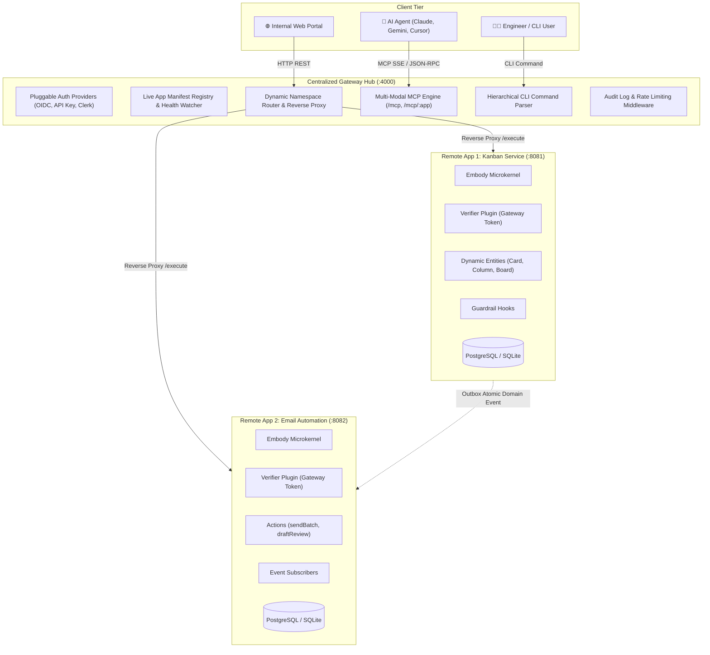

# 01. System Architecture & Centralized Gateway Specification

## 1. System Topology Overview

The Embody architecture consists of three primary tiers:
1. **Client Tier**: AI Agents (over Model Context Protocol / MCP), human engineers (over the unified CLI), and frontend web apps (over HTTP REST).
2. **Centralized Gateway Hub Tier**: An enterprise-grade, highly customizable router and security gateway that aggregates all organization-wide apps.
3. **Distributed Remote App Tier**: Autonomous, independently deployed microkernel apps (e.g. Kanban service, Email service, Billing service) running behind company networks or public cloud endpoints.



---

## 2. Gateway Responsibilities & Capabilities

The Gateway serves as the single pane of glass for all agent apps in an organization:

1. **Centralized App Registry**: Maintains a dynamic directory of available remote apps, their endpoint URLs, health status, and published capability manifests.
2. **Unified MCP Aggregator**: Serves a single MCP server endpoint where an AI agent can access tools from every registered app across the company.
3. **Unified CLI Gateway**: Directs commands from the single `embody` CLI binary to the appropriate remote app endpoint.
4. **Enterprise Identity & Auth**: Validates incoming credentials (OIDC, corporate SSO, personal API keys), enforces role-based access control (RBAC), and signs short-lived execution tokens for downstream apps.
5. **Auditing & Telemetry**: Records every tool execution with caller identity, timestamps, parameters, and duration into an enterprise audit trail.

---

## 3. Remote App Registration & Discovery Protocol

### 3.1 Push Registration Handshake
When a remote app starts up, it registers with the Gateway using an HTTP POST request:

```http
POST /api/registry/register HTTP/1.1
Host: gateway.internal
Authorization: Bearer <GATEWAY_APP_REGISTRATION_SECRET>
Content-Type: application/json

{
  "appId": "kanban",
  "version": "1.2.0",
  "endpoint": "https://kanban.internal:8081",
  "healthCheckUrl": "https://kanban.internal:8081/health",
  "manifest": {
    "entities": {
      "card": {
        "description": "Kanban board card",
        "schema": {
          "type": "object",
          "properties": {
            "title": { "type": "string" },
            "status": { "type": "string", "enum": ["todo", "in_progress", "done"] }
          },
          "required": ["title", "status"]
        }
      }
    },
    "actions": {
      "exportBoard": {
        "description": "Export kanban board with AI summaries",
        "inputSchema": {
          "type": "object",
          "properties": {
            "boardId": { "type": "string" }
          },
          "required": ["boardId"]
        }
      }
    }
  }
}
```

### 3.2 Heartbeat & Liveness
- **Interval**: Remote apps send a heartbeat ping (`POST /api/registry/heartbeat`) every 30 seconds.
- **TTL**: If the Gateway misses 3 consecutive heartbeats (90 seconds), the app status is updated to `unhealthy` and its tools are temporarily removed from the live MCP catalog.

### 3.3 Execution Dispatch Protocol
When a client (CLI or Agent) invokes an action via the Gateway:

```http
POST /api/execute/kanban/card.create HTTP/1.1
Host: gateway.internal
Authorization: Bearer <CALLER_USER_OR_AGENT_KEY>
Content-Type: application/json

{
  "data": {
    "title": "Fix memory leak in background worker",
    "status": "todo"
  }
}
```

The Gateway:
1. Authenticates the caller and verifies permissions (`ctx.can("kanban.card.create")`).
2. Issues a short-lived, signed JWT containing the verified caller `Principal`.
3. Forwards the request to `https://kanban.internal:8081/execute`:

```http
POST /execute HTTP/1.1
Host: kanban.internal:8081
X-Gateway-Auth: Bearer <GATEWAY_SIGNED_JWT>
Content-Type: application/json

{
  "target": "kanban.card.create",
  "input": {
    "data": {
      "title": "Fix memory leak in background worker",
      "status": "todo"
    }
  }
}
```
