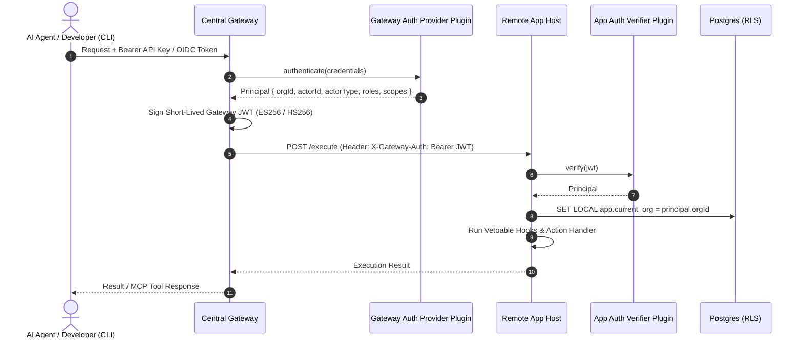

# 04. Pluggable Auth & Identity Specification

## 1. Dual-Sided Auth Architecture

Security in Embody is completely modular. Authentication is divided across two sides of the infrastructure:
1. **Gateway Auth Providers**: Pluggable strategies that authenticate inbound connections from human developers, AI agents, and internal microservices.
2. **Remote App Auth Verifiers**: Pluggable strategies on remote hosts that verify Gateway tokens and enforce tenant isolation.



---

## 2. Standard Identity Model (`Principal`)

Every request in the framework is bound to a standardized `Principal` object:

```typescript
export interface Principal {
  /**
   * Tenant or organization identifier for Row-Level Security isolation.
   */
  orgId: string;

  /**
   * Unique identifier of the actor.
   */
  actorId: string;

  /**
   * Distinguishes autonomous agents from human users or service accounts.
   */
  actorType: "agent" | "human" | "system";

  /**
   * Assigned organizational roles (e.g. ['admin', 'developer', 'viewer']).
   */
  roles: string[];

  /**
   * Granular capability scopes (e.g. ['kanban:*', 'email:read']).
   */
  scopes: string[];

  /**
   * Arbitrary metadata (e.g. modelName, agentVersion, department).
   */
  metadata?: Record<string, unknown>;
}
```

---

## 3. Gateway Auth Provider Plugin Interface

```typescript
export interface GatewayAuthProviderPlugin {
  id: string;
  name: string;

  /**
   * Extracts and validates credentials from the incoming HTTP request.
   */
  authenticate: (req: Request) => Promise<Principal | null>;
}
```

### Built-in Gateway Providers:
* `apiKeyAuthProvider`: Validates hashed API keys against database / environment secrets.
* `oidcAuthProvider`: Validates OpenID Connect JWTs (Okta, Auth0, Google Workspace, Azure AD).
* `clerkAuthProvider`: Validates Clerk session tokens for web applications.

---

## 4. Remote App Auth Verifier Plugin Interface

```typescript
export interface AppAuthVerifierPlugin {
  id: string;

  /**
   * Validates the execution token forwarded by the Gateway.
   */
  verify: (req: Request) => Promise<Principal>;
}
```

### Built-in App Verifiers:
* `gatewayJwtVerifier`: Verifies HMAC or asymmetric RSA/ECDSA signatures issued by the Central Gateway.
* `localDevVerifier`: In development mode (`NODE_ENV=development`), automatically assigns a default `dev-user` principal for zero-friction local testing.
