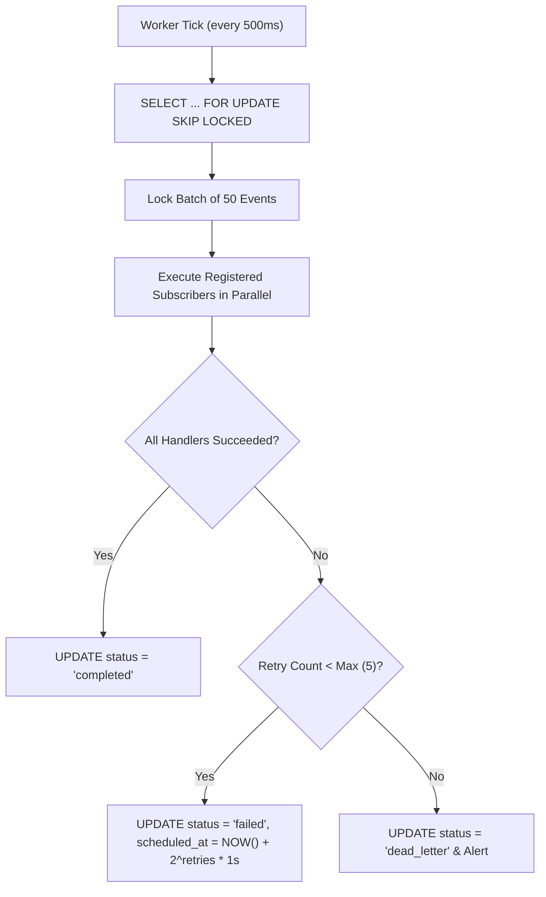

# 06. Durable Outbox, Events & Streaming Specification

## 1. Zero-Infrastructure Durability Design

The Embody Outbox Engine guarantees **at-least-once event delivery** across distributed apps without requiring external message brokers (such as Kafka, RabbitMQ, or Redis).

Events are persisted to a database table within the same ACID transaction as the triggering domain action, completely eliminating dual-write failure modes.

---

## 2. Outbox Table Schema

### 2.1 PostgreSQL Table
```sql
CREATE TABLE IF NOT EXISTS embody_outbox (
  id UUID PRIMARY KEY DEFAULT gen_random_uuid(),
  org_id TEXT NOT NULL,
  event_name TEXT NOT NULL,
  payload JSONB NOT NULL,
  status TEXT NOT NULL DEFAULT 'pending', -- 'pending', 'processing', 'completed', 'failed'
  retry_count INT NOT NULL DEFAULT 0,
  last_error TEXT,
  scheduled_at TIMESTAMPTZ DEFAULT NOW(),
  created_at TIMESTAMPTZ DEFAULT NOW(),
  updated_at TIMESTAMPTZ DEFAULT NOW()
);

-- Compound index for non-blocking queue draining
CREATE INDEX IF NOT EXISTS idx_outbox_queue 
  ON embody_outbox (status, scheduled_at, retry_count)
  WHERE status IN ('pending', 'failed');
```

---

## 3. In-Process Concurrent Worker Engine

When an application boots via `app.listen()`, the microkernel spins up an embedded worker loop:



### 3.1 Non-Blocking SQL Fetch
```sql
SELECT id, org_id, event_name, payload, retry_count
FROM embody_outbox
WHERE status IN ('pending', 'failed')
  AND scheduled_at <= NOW()
  AND retry_count < 5
ORDER BY scheduled_at ASC
LIMIT 50
FOR UPDATE SKIP LOCKED;
```

---

## 4. Real-Time Server-Sent Events (SSE) Streaming

For long-running tasks (e.g. AI batch generation, data exports), actions can emit live progress ticks:

```typescript
// Inside action handler
export const exportDataAction: ActionDefinition = {
  handler: async (input, ctx) => {
    ctx.progress({ percent: 10, message: "Reading records..." });
    const records = await fetchRecords();

    ctx.progress({ percent: 50, message: "Synthesizing AI summaries..." });
    const summaries = await generateSummaries(records);

    ctx.progress({ percent: 100, message: "Export complete" });
    return { url: "https://..." };
  }
};
```

### 4.1 SSE Protocol Wire Format
When invoked over `GET/POST /execute/stream` or the Gateway:
```http
HTTP/1.1 200 OK
Content-Type: text/event-stream
Cache-Control: no-cache
Connection: keep-alive

event: progress
data: {"percent": 10, "message": "Reading records..."}

event: progress
data: {"percent": 50, "message": "Synthesizing AI summaries..."}

event: result
data: {"url": "https://..."}
```
